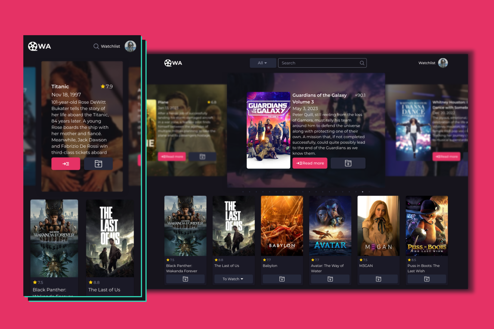

 

  <h1 align="center">Watching Assistant</h1>
  

   <h3 align="center">
    <a href="https://watching-assistant.vercel.app/">View Live</a>
  </h3>

## About The Project

Watching Assistant is a website for tracking movies and TV shows. Users can create watchlists, mark titles as watched or currently watching, and track their progress through TV shows by season and episode.

### Build With

- [Next.js](https://nextjs.org/)
- [TypeScript](https://www.typescriptlang.org/)
- [MongoDB](https://www.mongodb.com/)
- [TailwindCSS](https://tailwindcss.com/)

### To-Do List

- [ ] Enhance Person Details
  - [ ] Show credits for actors, producers, and creators.
  
- [ ] Optimize Watchlist Experience
  - [ ] Implement pagination for the watchlist to avoid long scrolling for users with many entries.
  - [ ] Improve the search functionality for quicker access to specific titles.

- [ ] Add to User Settings
  - [ ] Changing password
    - [ ] Contact to user Email
    - [ ] Generate a Verification Code (Store this verification in database along with a timestamp to track its validity period.)
    - [ ] Verify the Code
    - [ ] If the verification is successful, Allow password change
    - [ ] After successful verification or after 3x fail attempt, remove the verification code from the database.
  - [ ] Uploading user profile images
  - [ ] Disabling / Managing animations for better performance

- [ ] Add Movie from Different Streaming Services
  - [ ] Research and implement functionality to add movies from different streaming platforms.
  - [ ] Integrate a comment section to facilitate communication between users from different platforms, even with a limited user base.

- [ ] Code Refactoring
  - [ ] Improve code structure by creating reusable components with props to reduce duplicate code (e.g., common elements, SVGs).
  - [ ] Refactor API calls.